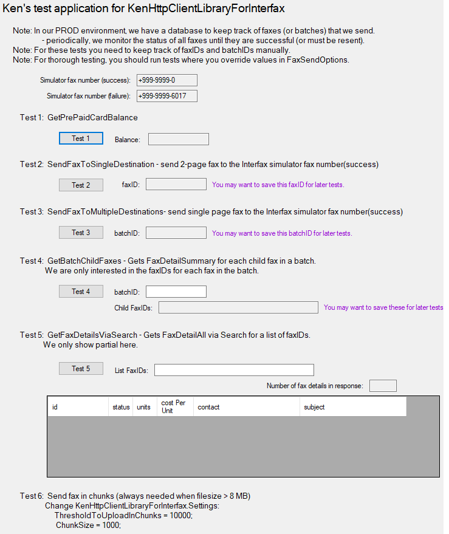
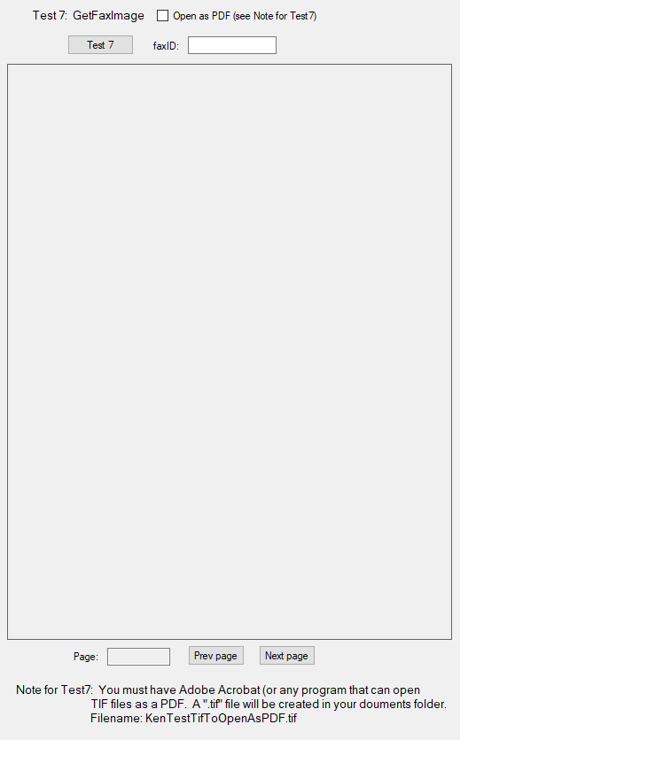

<h1>This is a windows app to test KenHttpClientLibraryForInterfax</h1> 

## Visual Studio Setup
Steps:
 1. Clone KenHttpClientLibraryForInterfax from GitHub into a chosen top level directory.
 1. In Visual Studio, Build KenHttpClientLibraryForInterfax.
 1. Clone KenHttpClientTestAppForInterfax from GitHub into the same top level directory.
    1. Open KenHttpClientTestAppForInterfax with Visual Studio.
    1. Both projects that were cloned should be present.
    1. Build Solution to make sure there are no errors.
    1. Update Form1.cs with MY_INTERFAX_USERID and MY_INTERFAX_PASSWORD.
    1. Build Solution and start the app.

**YouTube video**  This video demonstrates the functionality of KenHttpClientLibraryForInterfax. 
https://youtu.be/3xHhg4TFuqc

